# dieciocho

Un plugin de [Claude Code](https://claude.com/claude-code) que viste de huaso al bichito
del banner para el 18 de septiembre.

Escribes `/dieciocho` y el banner se transforma:

```
   ██████     Claude Code v2.1.266
 ██████████   Opus 5 (1M context) with high effort
 ██████████   C:\Users\tu-nombre
  ▀▀▀▀▀▀▀▀
   ██  ██     ★ faltan 9 días pal 18
```

Sale uno de tres monitos al azar —huaso, bandera o volantín— y la cuenta regresiva se
calcula sola. Pasado el 19 empieza a contar para el próximo año, así que sirve todo el
tiempo sin tocar nada.

De yapa, cambia los verbos del spinner por chilenismos: en vez de *Bloviating…* te sale
**Rayueleando…**, **Anticucheando…**, **Terremoteando…**

## Instalar

```
/plugin marketplace add GonzalitoCaro/claude-code-dieciocho
/plugin install dieciocho@claude-code-dieciocho
```

Listo. Escribe `/dieciocho`.

Funciona en Windows, macOS y Linux. En Windows necesitas tener Git instalado, porque
Claude Code corre los hooks en el bash de Git.

### Sin plugin, a mano

Si prefieres solo la skill, sin el hook que transforma el banner:

```bash
git clone https://github.com/GonzalitoCaro/claude-code-dieciocho /tmp/dieciocho
cp -r /tmp/dieciocho/skills/dieciocho ~/.claude/skills/dieciocho
```

Así `/dieciocho` dibuja igual, pero abajo de la conversación en vez de arriba.

## Qué instala y qué hace

Vale la pena leer esto antes, porque el plugin trae un **hook**, y un hook es código que
corre en tu máquina.

| | |
|---|---|
| **Cuándo corre** | En cada mensaje que escribes, y una vez al arrancar cada sesión |
| **Qué hace** | En cada mensaje busca la palabra "dieciocho" en tu prompt; si no está, se apaga y no hace nada más. Al arrancar, revisa si ya prendió los verbos del spinner y, si no, los prende |
| **Qué lee** | Tu prompt, la altura de la ventana de la terminal (en Windows se engancha a la consola de Claude Code para leerla, nada más), y de tu `settings.json` solo el modelo y el nivel de esfuerzo, para que el banner diga lo mismo que el de verdad |
| **Qué escribe** | Una sola vez, la clave `spinnerVerbs` en tu `~/.claude/settings.json`, y una marca vacía `~/.claude/dieciocho-verbos.hecho` para no volver a tocarlo. Si ya tenías `spinnerVerbs`, no te los pisa. Si tu `settings.json` no es JSON válido, no lo toca |
| **Qué manda por red** | Nada. No hay una sola llamada de red en el código |
| **Cuánto demora** | ~120 ms cuando no calza. Por eso el filtro es un `grep` y no algo más pesado |

Son unas 600 líneas entre bash y PowerShell, en `skills/dieciocho/`, y la mitad son
comentarios: si vas a dejar que algo corra en cada mensaje que escribes, revísalo primero.

Para desinstalar: `/plugin uninstall dieciocho@claude-code-dieciocho`.

## Los doce monitos

Todos respetan la grilla del bicho original, 17 columnas, ojos en las columnas 4 y 12 y
cuatro patitas. Lo que cambia es el sombrero, el poncho y si lleva volantin.

El nombre es `<poncho>-<sombrero>[-volantin]`, con poncho `huaso`, `bandera` o
`chamanto`, y sombrero `negra` o `paja`. Las doce combinaciones entran al sorteo, asi
que cada vez que escribes `/dieciocho` sale una distinta.

| | Nombre | Qué es |
|---|---|---|
| 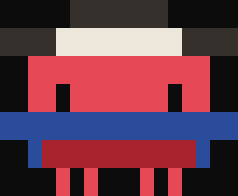 | `huaso-negra` | chupalla negra con cinta, poncho azul con franja roja |
| 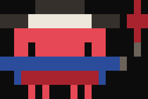 | `huaso-negra-volantin` | chupalla negra con cinta, poncho azul con franja roja, con volantin |
| 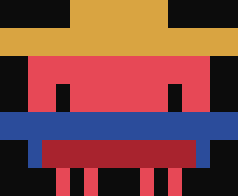 | `huaso-paja` | chupalla de paja, poncho azul con franja roja |
| 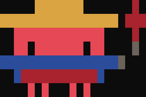 | `huaso-paja-volantin` | chupalla de paja, poncho azul con franja roja, con volantin |
| 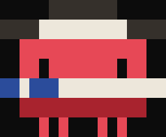 | `bandera-negra` | chupalla negra con cinta, la bandera: canton azul con estrella, blanco y franja roja |
| 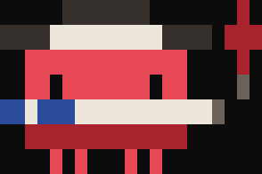 | `bandera-negra-volantin` | chupalla negra con cinta, la bandera: canton azul con estrella, blanco y franja roja, con volantin |
| 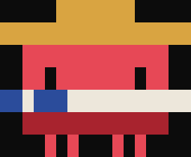 | `bandera-paja` | chupalla de paja, la bandera: canton azul con estrella, blanco y franja roja |
| 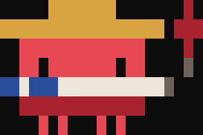 | `bandera-paja-volantin` | chupalla de paja, la bandera: canton azul con estrella, blanco y franja roja, con volantin |
| 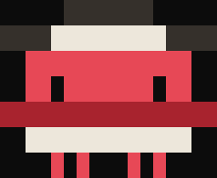 | `chamanto-negra` | chupalla negra con cinta, chamanto rayado, rojo sobre lana |
| 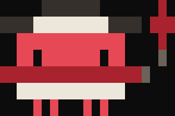 | `chamanto-negra-volantin` | chupalla negra con cinta, chamanto rayado, rojo sobre lana, con volantin |
| 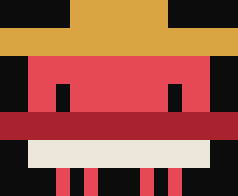 | `chamanto-paja` | chupalla de paja, chamanto rayado, rojo sobre lana |
| 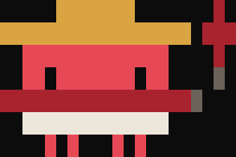 | `chamanto-paja-volantin` | chupalla de paja, chamanto rayado, rojo sobre lana, con volantin |

Para pedir uno en particular, dile a Claude "dame el chamanto con volantin".

Los nombres viejos siguen sirviendo: `huaso`, `bandera`, `volantin`, `huaso-paja`,
`bandera-paja` y `volantin-negro`.

Las fotos se generan desde la salida real del renderizador con
`python imagenes/generar.py`, asi que no pueden quedar desfasadas del codigo.

## Cómo está dibujado

**Un píxel por celda de terminal**, con `█`. Una celda es el doble de alta que de ancha,
así que los píxeles son rectángulos parados — y esa es justamente la geometría del bicho
original. Con medio bloque (`▀`) los píxeles salen cuadrados y el monito queda achatado a
la mitad al lado del original.

Los sprites son texto plano, una letra por color:

```
.....nnnnnnn.....      c  coral (el color original del bicho)
nnnnwwwwwwwwwnnnn      p  paja          n  negro de la chupalla
..ccccccccccccc..      a  azul          w  cinta blanca
..cc.ccccccc.cc..      r  rojo          h  hilo del volantín
aaaaaaaaaaaaaaaaa      b  lana          .  fondo
..arrrrrrrrrrra..
....c.c...c.c....
```

Si agregas uno, edítalo en los dos renderizadores (`.ps1` y `.sh`) con las mismas letras.

## Los verbos del spinner

Están en `skills/dieciocho/verbos.json`. Son 28 y con el plugin se prenden solos la
primera vez que arranca Claude Code: quedan como la clave `spinnerVerbs` de tu
`~/.claude/settings.json`.

```json
"spinnerVerbs": { "mode": "replace", "verbs": ["Dieciocheando", "Cuequeando", "..."] }
```

`replace` deja solo los chilenos; `append` los mezcla con los originales. Se aplican al
toque, sin reiniciar. Para apagarlos, saca la clave, o dile a Claude "sácame los verbos":
el plugin no la vuelve a poner. Si instalaste la skill a mano, sin plugin, pégala tú.

## Lo que no se puede

El bicho del banner de arranque **no se puede reemplazar**: está hardcodeado en el binario
de Claude Code. Por eso el plugin no lo reemplaza, lo **tapa**: dibuja el suyo y empuja el
original fuera de la pantalla con líneas en blanco.

Quedan ~6 columnas de sangría a la izquierda que tampoco se pueden sacar, porque Claude
Code renderiza los mensajes de hook indentados. En `ESTADO.md` está la lista completa de
lo que se intentó y por qué no se puede, para que nadie lo reintente.

## Ajustes

El hook mide cuántas filas tiene tu terminal cada vez que dibuja y calcula solo el
relleno: arriba una pantalla entera, para que el banner original salga por el techo, y
abajo lo justo para que el huaso quede arriba. Así se ve igual en una ventana chica y en
una maximizada. Si prefieres fijarlo a mano, con variables de entorno:

- `DIECIOCHO_FILAS`: filas de la terminal, por si la medición falla o quieres forzarla.
- `DIECIOCHO_EMPUJE`: líneas en blanco arriba, las que empujan el banner original.
- `DIECIOCHO_EMPUJE_ABAJO`: líneas abajo, las que suben el dibujo.

Si no se puede medir, usa 40 arriba y 14 abajo, que calzan con una ventana de unas 30
filas.

## Licencia

MIT. Haz lo que quieras con esto.
